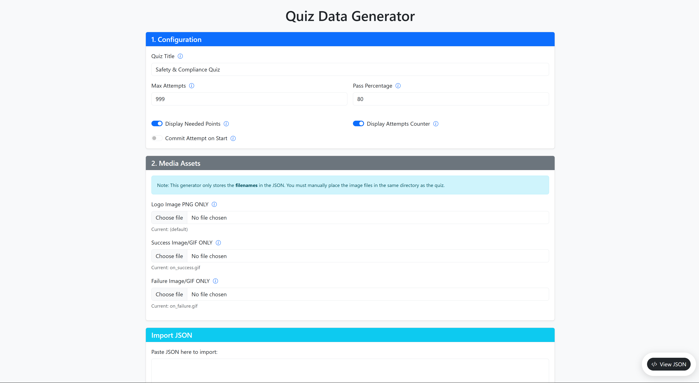
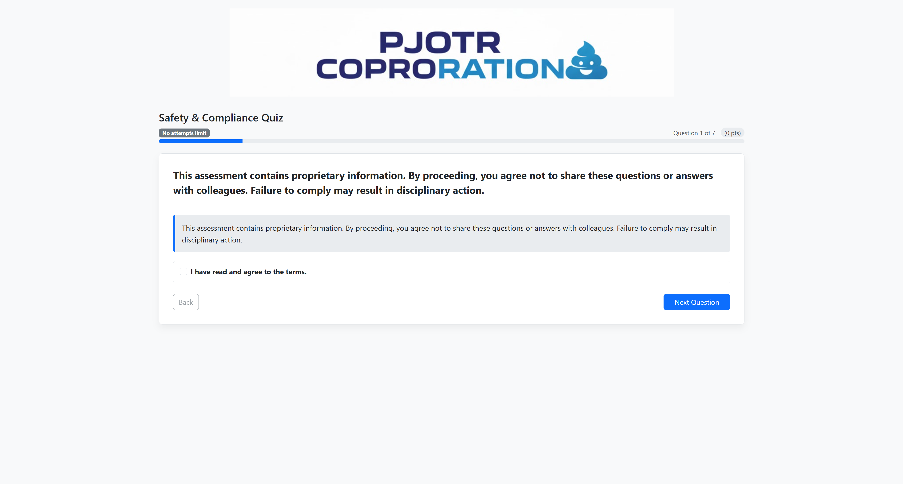

# SCORM Package Generator

A web-based tool for creating SCORM 1.2 compliant assessment packages. This project allows users to visually design quizzes, configure settings, and generate a downloadable ZIP package ready for LMS upload.

## Map for future development

1. add drag and drop question type
2. add different languages for questions
3. add dark light colorblind mode
## Features

### 1. Quiz Generator (`quiz_generator.html`)
The frontend interface for creating assessments.



*   **Visual Question Editor**: Add, edit, and reorder questions.
*   **Supported Question Types**:
    *   Single Choice (Radio)
    *   Multiple Choice (Checkbox)
    *   True/False (Boolean)
    *   Text Input (Exact match)
    *   Fill in the Blank (Dropdown)
    *   Description / Information Block
*   **Configuration**:
    *   Set Quiz Title
    *   Max Attempts (1-999)
    *   Pass Percentage
    *   Toggle Points Display
    *   Toggle Attempts Counter
    *   Commit Attempt on Start vs. Finish
*   **Media Support**: Upload custom Logo, Success GIF, and Failure GIF.
*   **JSON Import/Export**: Save your work and reload it later.
*   **SCORM Export**: One-click generation of a SCORM 1.2 ZIP package.

### 2. SCORM Player (`source/index.html`)
The engine that runs the assessment within the LMS.



*   **SCORM 1.2 Compliant**: Handles `LMSInitialize`, `LMSSetValue`, `LMSCommit`, and `LMSFinish`.
*   **State Tracking**: Uses `cmi.suspend_data` to resume user progress and track attempts.
*   **Responsive Design**: Built with Bootstrap 5 for mobile and desktop compatibility.
*   **Smart Navigation**:
    *   **Welcome Screen**: Shows previous score and attempts for returning users.
    *   **Lock Screen**: Prevents access if max attempts are reached.
    *   **Result Screen**: Displays score, percentage, and pass/fail animation.

### 3. Backend Generator (`scorm_creator.php`)
The server-side script that packages the assessment.
*   Receives JSON data and media files.
*   Creates a unique, timestamped submission folder.
*   Copies the player template (`source/`) and assets.
*   Generates a `quiz_data.json` file.
*   Compresses the result into a `.zip` file for easy download.

## Installation & Setup

1.  **Server Requirements**: A PHP-enabled web server (e.g., Apache/XAMPP).
2.  **Directory Structure**:
    ```
    /SCORM_PACK
    ├── quiz_generator.html   # The editor interface
    ├── scorm_creator.php     # The backend processor
    ├── source/               # Template files for the SCORM package
    │   ├── index.html        # The player engine
    │   ├── imsmanifest.xml   # SCORM manifest
    │   └── ... (default media)
    ├── submissions/          # Generated packages (auto-created)
    └── ...
    ```
3.  **Permissions**: Ensure the server has write permissions for the `submissions/` directory.

## Usage Guide

1.  **Open the Generator**: Navigate to `http://localhost/SCORM_PACK/quiz_generator.html`.
2.  **Configure Settings**: Set the title and passing criteria in the sidebar.
3.  **Add Questions**: Use the "Add Question" buttons to build your assessment.
4.  **Upload Media** (Optional): Select custom images for the logo and result screens.
5.  **Preview**: Click "View JSON" to see the underlying data structure.
6.  **Generate**: Click **"Download SCORM"** in the modal.
    *   The system will process the files and download a `.zip` file.
7.  **Deploy**: Upload the `.zip` file to any SCORM 1.2 compliant LMS (e.g., Moodle, SCORM Cloud).

## Technical Details

*   **Frontend**: HTML5, JavaScript, Bootstrap 5.
*   **Backend**: PHP (ZipArchive extension required).
*   **Data Format**: JSON used for quiz configuration and state persistence.
*   **SCORM Version**: 1.2.

## File Structure of Generated Package
The downloaded ZIP will contain:
*   `imsmanifest.xml`: The SCORM descriptor.
*   `index.html`: The player entry point.
*   `quiz_data.json`: The specific quiz content.
*   `logo.png`, `on_success.gif`, `on_failure.gif`: Media assets.
